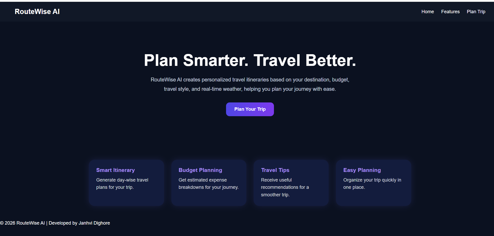
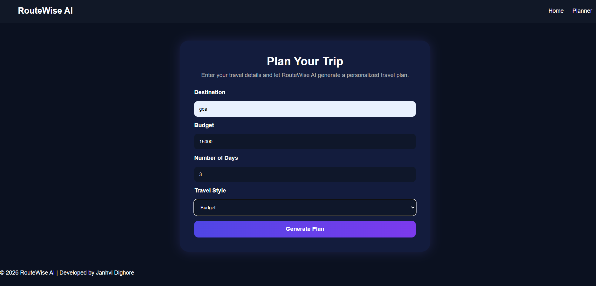
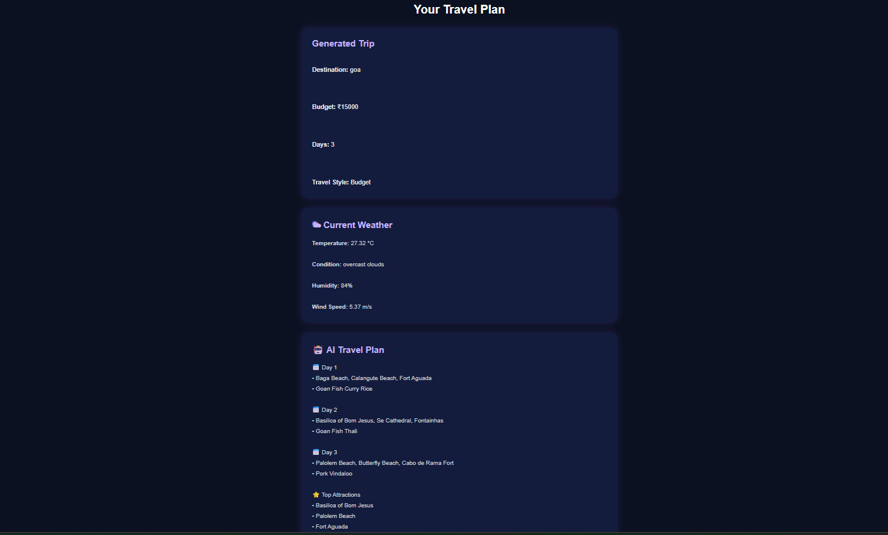

# 🌍 RouteWise AI

An AI-powered travel planner built using Flask, HTML, CSS, JavaScript, Google Gemini AI, and OpenWeather API. It generates personalized travel itineraries and provides real-time weather updates.

## 🚀 Live Demo

**Frontend:** https://janhvid.github.io/RouteWiseAI/

**Backend:** https://routewiseai-gtpy.onrender.com/

## ✨ Features

- AI-generated travel itinerary
- Real-time weather information
- Budget-based trip planning
- Personalized travel plans
- Responsive user interface

## 🛠 Technologies Used

- Python
- Flask
- HTML
- CSS
- JavaScript
- Google Gemini AI
- OpenWeather API
- Git & GitHub
- GitHub Pages
- Render

## 📷 Screenshots

### Home Page

### Trip Planner

### AI Generated Travel Plan

## 👩‍💻 Author

**Janhvi Dighore**

GitHub: https://github.com/JanhviD